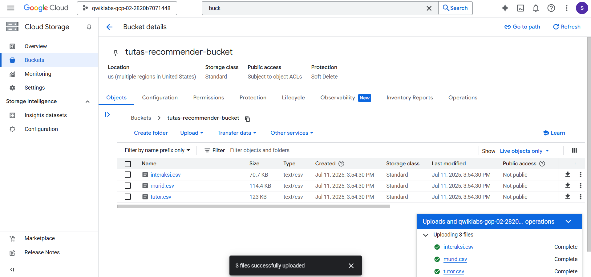
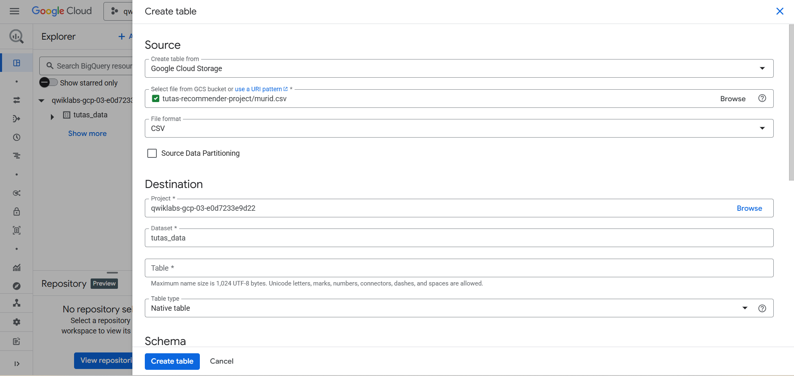
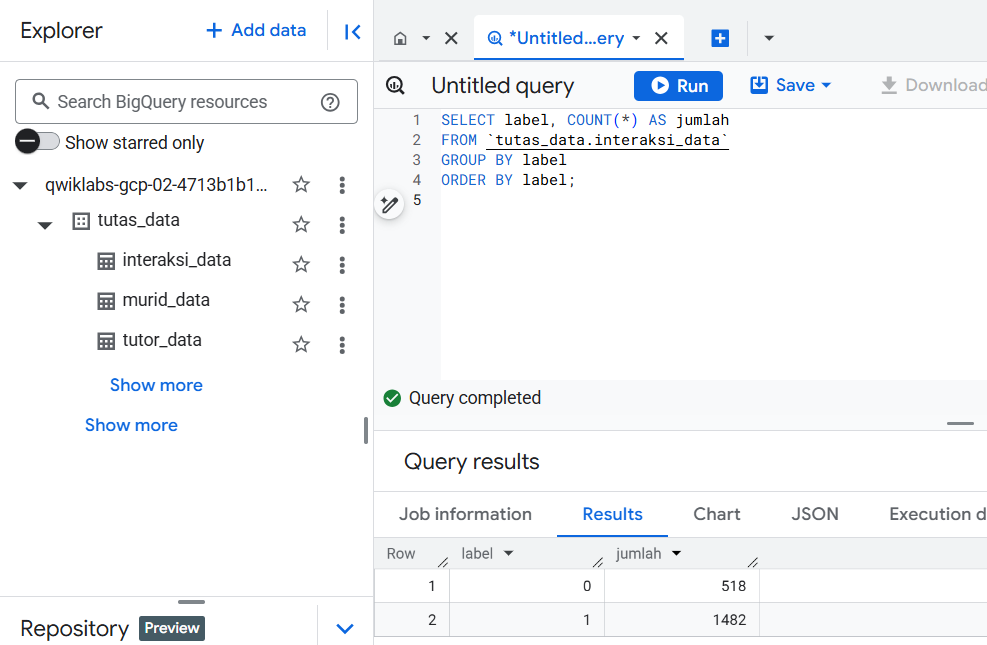
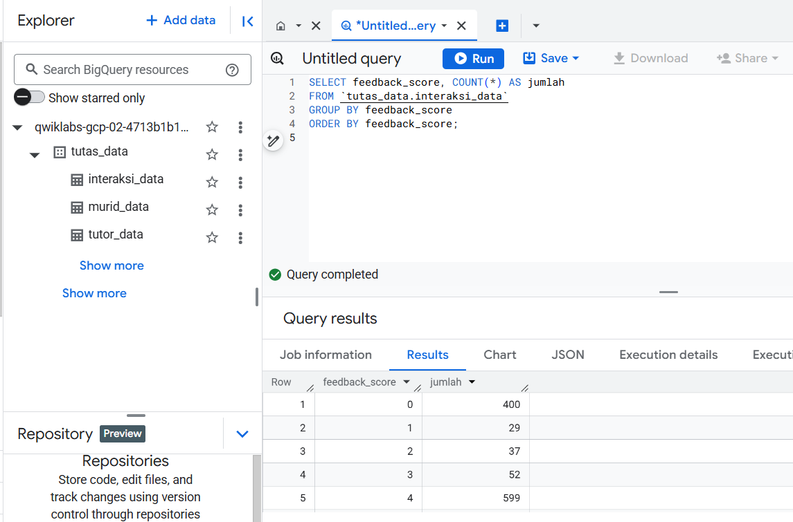
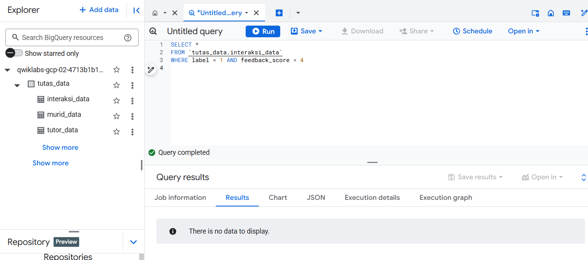
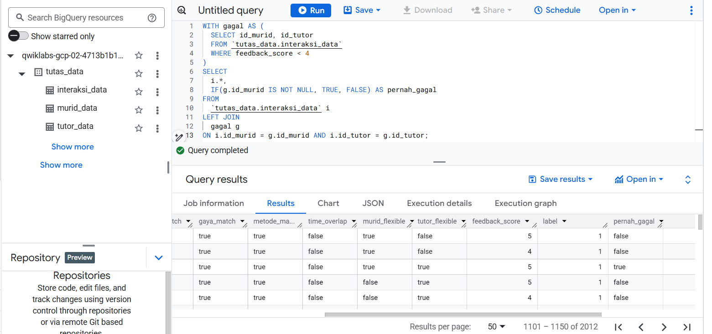
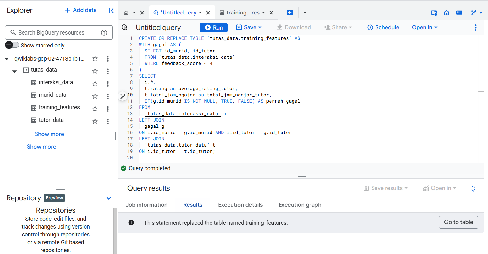

# Tutas Recommender – Synthetic Data Generator

This repository provides a pipeline for generating **synthetic datasets** to train and evaluate a recommender system.  
It creates student profiles, tutor profiles, and labeled interactions, which can be used to prototype and test machine learning models.  
All data is **synthetic** (using Faker + custom logic) and safe for demonstration or educational purposes.

---

## 📂 Project Structure

```
.
├── dataset/
│   ├── unprocessed/         # Raw synthetic data (direct output of main.py)
│   │   ├── murid.csv
│   │   ├── tutor.csv
│   │   ├── interaksi.csv
│   │
│   ├── processed_1/         # Processed dataset from BigQuery (feature-engineered)
│   │   └── tutas_recommender_training_features.csv
│   │
│   └── processed_2/         # Processed dataset from scripts/preprocess.ipynb (train/test split)
│       ├── X_train.csv
│       ├── X_test.csv
│       ├── y_train.csv
│       └── y_test.csv
│
├── config.py                # Global configuration (constants, parameters)
├── generators.py            # Functions to generate murid/student, tutor, and interaksi/interaction datasets
├── main.py                  # Main entry point for dataset generation
├── utils.py                 # Helper functions (faker init, random windows, weighted choice, overlap check)
└── readme.md                # Project documentation

```

## 🚀 Usage

### 1. Generate raw synthetic data

Run the main script to create student, tutor, and interaction datasets:
```bash
python main.py
```

The output files will be saved in `dataset/unprocessed/`:

* `murid.csv`
* `tutor.csv`
* `interaksi.csv`
---

### 2. Process data with BigQuery

Upload the raw CSVs from `dataset/unprocessed/` into **Google Cloud BigQuery**.  
Use SQL queries to perform **feature engineering and data transformation**, combining the student, tutor, and interaction datasets into a single training-ready table.

Output:
* `tutas_recommender_training_features.csv` → stored under `dataset/processed_1/`

#### Step 2.1 – Create Bucket and Upload Dataset

Before running any SQL in BigQuery, the raw CSV files need to be stored in **Google Cloud Storage (GCS)**.  
This step creates a dedicated bucket (e.g., `tutas-recommender-bucket`) and uploads the three datasets generated in Step 1:

- `murid.csv` → student profiles  
- `tutor.csv` → tutor profiles  
- `interaksi.csv` → interaction records  

Once uploaded, these files serve as the **source data** that will be imported into BigQuery tables for transformation and feature engineering.



#### Step 2.2 – Create Tables in BigQuery

After uploading the raw CSV files into **Google Cloud Storage**, the next step is to create tables in **BigQuery**.  
Each CSV file (`murid.csv`, `tutor.csv`, `interaksi.csv`) is imported as a separate BigQuery table inside a dataset (e.g., `tutas_data`).

In this step:
- **Source**: Select *Google Cloud Storage* as the input, and point to the CSV file path (e.g., `tutas-recommender-project/murid.csv`).  
- **Destination**: Define the target project, dataset, and table name inside BigQuery.  
- **Schema**: BigQuery automatically detects schema from the CSV file, but can also be manually adjusted if needed.  

This process is repeated for each dataset to ensure that all raw data is accessible in BigQuery for SQL queries and feature engineering.



#### Step 2.3 – Run SQL Queries for Feature Engineering

Feature engineering in BigQuery is performed through a series of SQL queries.  
Each query transforms or enriches the raw data into features that will be used for training the recommender model.

**a. Validate Data Distribution**

Before feature engineering, it is important to validate the quality and consistency of the raw interaction data.  
This step checks the balance of labels, the distribution of feedback scores, and ensures no anomalies in the label–feedback relationship.

📊 **Check distribution of labels (positive vs negative)**

```sql
SELECT label, COUNT(*) AS jumlah
FROM `tutas_data.interaksi_data`
GROUP BY label
ORDER BY label;
```

This query counts how many records are labeled 0 (negative) and 1 (positive).
It helps to identify if the dataset is balanced or skewed.



📊 **Check distribution of feedback\_score**

```sql
SELECT feedback_score, COUNT(*) AS jumlah
FROM `tutas_data.interaksi_data`
GROUP BY feedback_score
ORDER BY feedback_score;
```

This query validates the spread of feedback scores across all interactions.
It ensures that the scoring system is consistent and covers the expected range.



⚠️ **Validate that `label = 1` only occurs when `feedback_score >= 4`**

```sql
SELECT *
FROM `tutas_data.interaksi_data`
WHERE label = 1 AND feedback_score < 4;
```

This query checks for anomalies where a positive label (`label = 1`) is assigned even though the feedback score is below 4.
No rows should be returned here — if results exist, it indicates data labeling errors.


📌 **b. Create Feature: `pernah_gagal` and Join Metadata**

📊 **Identify past failed pairs (feedback < 4) and add `pernah_gagal` flag**

```sql
-- Identify past failed pairs (feedback < 4)
WITH gagal AS (
  SELECT id_murid, id_tutor
  FROM `tutas_data.interaksi_data`
  WHERE feedback_score < 4
)

-- Join with main data to add 'pernah_gagal' flag
SELECT
  i.*,
  IF(g.id_murid IS NOT NULL, TRUE, FALSE) AS pernah_gagal
FROM
  `tutas_data.interaksi_data` i
LEFT JOIN
  gagal g
ON i.id_murid = g.id_murid AND i.id_tutor = g.id_tutor;
```

This query creates a new feature called **`pernah_gagal`** (ever failed).
It flags student–tutor pairs that had at least one past interaction with `feedback_score < 4`.



📊 **Join tutor metadata to enrich features**

```sql
-- Join tutor metadata to include rating and teaching hours
WITH gagal AS (
  SELECT id_murid, id_tutor
  FROM `tutas_data.interaksi_data`
  WHERE feedback_score < 4
)

SELECT
  i.*,
  t.rating,
  t.total_jam_ngajar,
  IF(g.id_murid IS NOT NULL, TRUE, FALSE) AS pernah_gagal
FROM `tutas_data.interaksi_data` i
LEFT JOIN `tutas_data.tutor_data` t
  ON i.id_tutor = t.id_tutor
LEFT JOIN gagal g
  ON i.id_murid = g.id_murid AND i.id_tutor = g.id_tutor;
```

This query enriches the interaction dataset with tutor-level metadata:

* **`rating`** → average tutor rating.
* **`total_jam_ngajar`** → total hours of teaching experience.
* **`pernah_gagal`** flag from the previous step.

This prepares a more complete training dataset for the recommender system.




📊 **Calculate failure rate (insight check)**

```sql
-- Calculate how many historical pairings failed
SELECT
  COUNT(*) AS total_interaksi,
  COUNTIF(pernah_gagal) AS jumlah_gagal,
  ROUND(COUNTIF(pernah_gagal)/COUNT(*) * 100, 2) AS persen_gagal
FROM `tutas_data.training_features`;
```

This query provides insight into the failure rate of student–tutor pairings:

* `total_interaksi` → total number of interactions.
* `jumlah_gagal` → how many interactions are flagged as failed.
* `persen_gagal` → percentage of failed interactions.

This step validates whether the new feature **`pernah_gagal`** captures meaningful historical failure patterns in the dataset.

---
### 3. Preprocess data for machine learning

Use the provided Jupyter notebook inside `scripts/` to clean and split the data:

scripts/preprocess.ipynb


This notebook takes the raw CSVs from `dataset/unprocessed/` and produces processed files in `dataset/processed/`:
* `X_train.csv`, `X_test.csv`
* `y_train.csv`, `y_test.csv`

---

📌 **Note**: The preprocessing step includes feature engineering and train/test splitting,
which prepares the data for ML model training.

