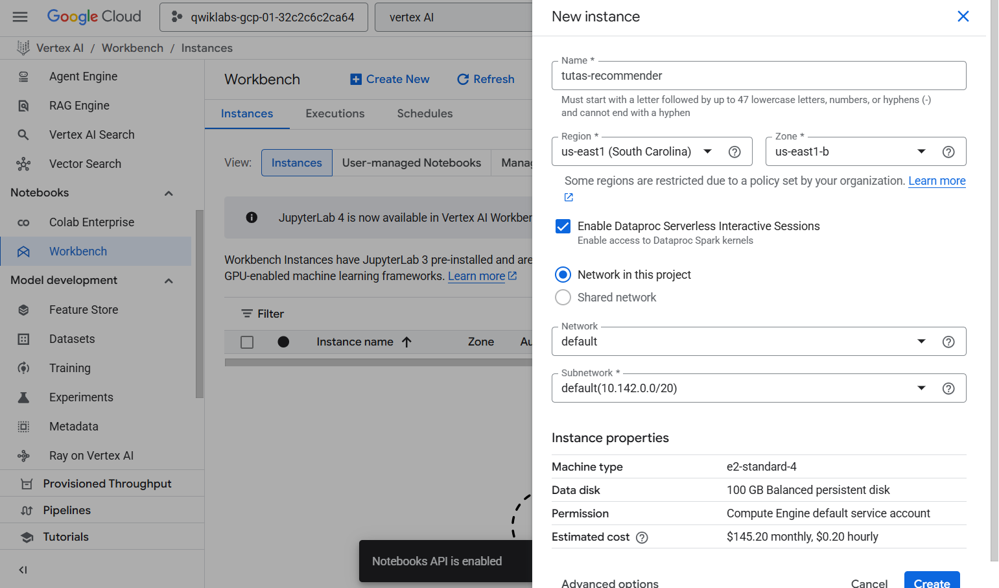
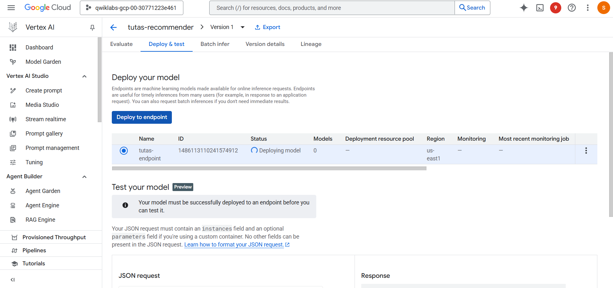
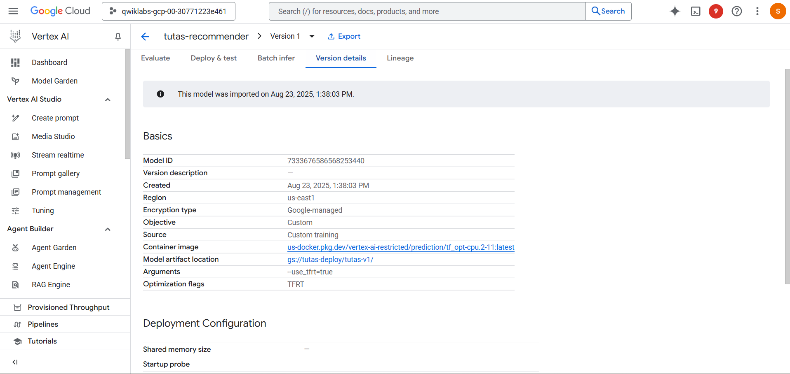

---

## 🚀 Deploy Model on Vertex AI

### 1️⃣ Create a new Workbench instance

Create a Vertex AI Workbench instance to manage deployment.

* Set **name** (e.g., `tutas-recommender`)
* Choose **region/zone** (e.g., `us-east1-b`)
* Machine type: `e2-standard-4`
* Disk: 100 GB
* Permissions: Default service account

This instance will be used to handle deployment and monitoring tasks.

---

### 2️⃣ Deploy trained model to endpoint

From Vertex AI Console:

* Navigate to **Deploy & Test**
* Select the trained model version
* Create an endpoint (e.g., `tutas-endpoint`)
* Deploy the model for real-time inference

---

### 3️⃣ Check model version details

Once deployed, verify the deployment configuration under **Version details**.
This ensures the correct model artifact is being served and monitored.

Key details:

* Model ID
* Container image
* Artifact location (GCS path)
* Deployment configuration

---

