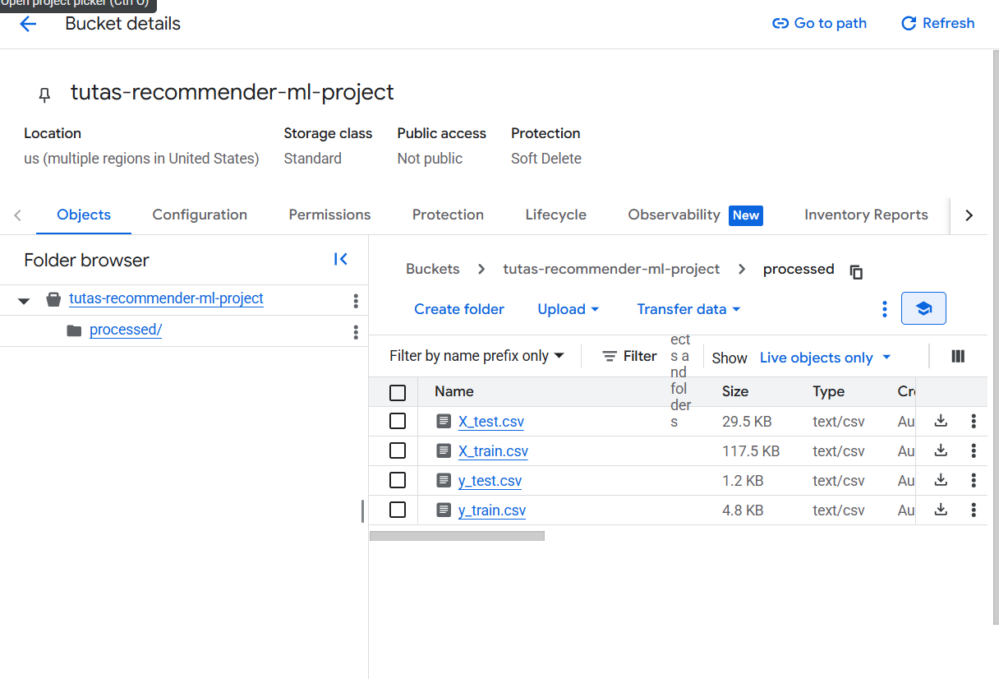
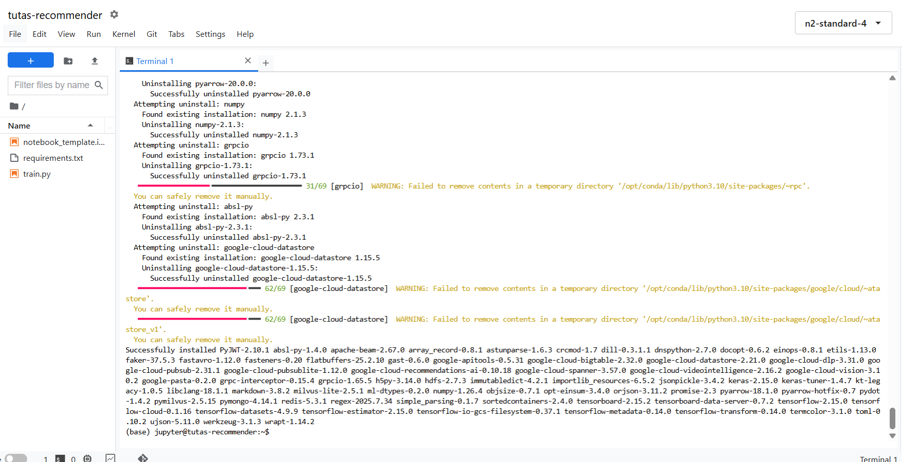
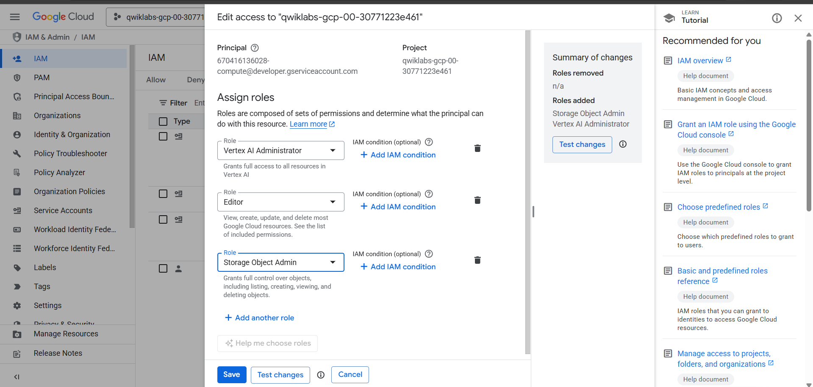
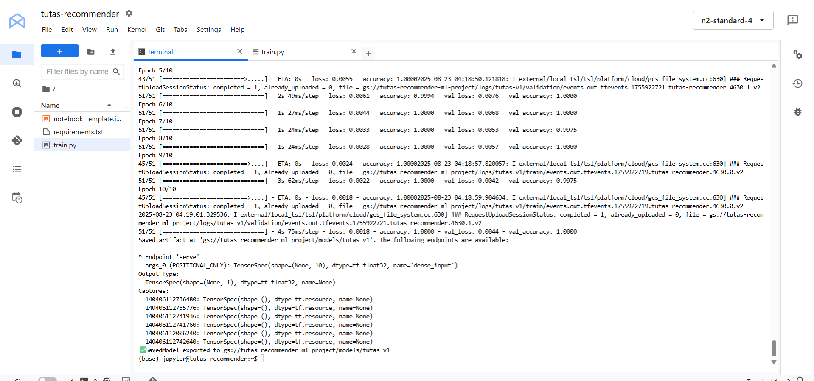
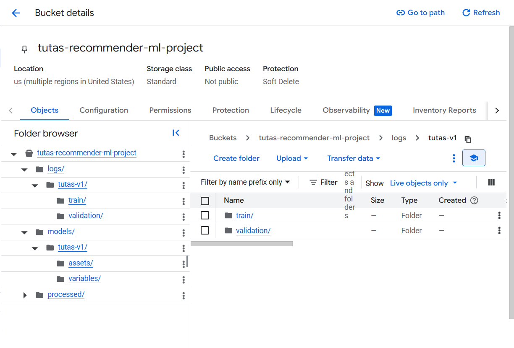

---

# 📘 Training Model in Vertex AI

This section documents the process of training the **Tutas Recommender** model using **Google Cloud Vertex AI**.
Each step ensures the dataset, environment, and IAM roles are properly set before running the training job.

---

## ⚡ Step 1 – Upload processed dataset to GCS

The preprocessed train/test splits (`X_train.csv`, `y_train.csv`, `X_test.csv`, `y_test.csv`) are uploaded to a **Google Cloud Storage bucket**.

This ensures Vertex AI can directly access the data during training.


---

## ⚡ Step 2 – Install dependencies from `requirements.txt`

Before launching training, all Python dependencies (TensorFlow, Pandas, GCP SDK, etc.) are installed inside the Vertex AI Workbench environment using:

```bash
pip install -r requirements.txt
```

This guarantees that the training script (`train.py`) runs consistently with the required libraries.


---

## ⚡ Step 3 – Configure IAM permissions for training

The service account needs **Vertex AI Administrator** and **Storage Object Admin** roles to train and save models in GCS.

This step ensures the training script has the right permissions to read datasets and write trained models/logs back to GCS.


---

## ⚡ Step 4 – Run training job in Vertex AI Workbench

Execute the training script (`train.py`) inside the workbench.
It will:

1. Load datasets from GCS
2. Train the TensorFlow model
3. Log metrics (loss, accuracy, val\_loss, val\_accuracy)
4. Export the trained model to GCS under `/models/tutas-v1/`



---

## ⚡ Step 5 – Review training results

Once training is complete, check the console logs for accuracy and loss curves.
The trained model (`saved_model.pb` with weights under `/variables/`) is now available in the designated GCS bucket.

This versioned model is ready for deployment or further evaluation.


---
